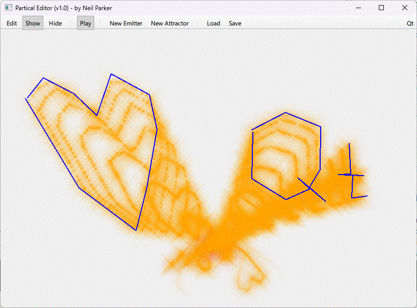
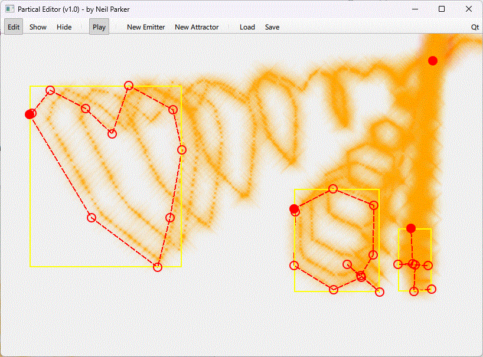

# LearnParticles2dQML

This is a work in progress (just started!) application purely for learning the Qt particle system
and a few other things that I have been wanting to practice, like Shapes and user
interaction with the UI controls.

## Goals
- **Learn** all aspects of **QML Particles** - https://doc.qt.io/qt-6/qtquick-particles-qmlmodule.html
- Provide an  interactive **Particle Editor** for being creative for your next project.
- Add the tool as a WASM application for anyone to immediately experiment with. 

## FEATURES (In Progress)
- Create any number of emitters and edit there shape (ShapePath) and position on the screen
- Create any number of attractors, only the position can be changed.
- Hide the editor function and shapes to see the final ShaderEffect

## TODOS and IDEAS
- PRIO Save and restore of setup (JSON?)
- Add an editor pane (like QmlDesigner does?) for each particle element (fun part !)
- Creation of all types of Particle elements (Effectors, Particle Painter, Particle Groups)
- Creation of all types of emitter shapes (Particle Extruder)
- add configurable styling (dark mode etc)
- drag & drop your image files (storage with WASM? Store to file system??) - how about using the Camera !
- image based (MaskShape) emitter
- (nice to have) - Export the creation to QML files for use in other applications.
  I am thinking along the line to do this like the Qt effects editor does.
- ...
- any other idea that comes to mind while do this (-;

